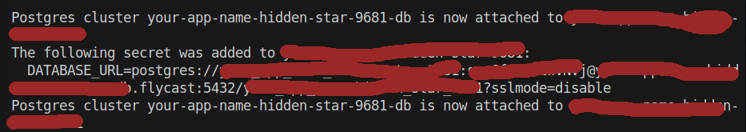
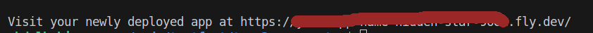

# Team3Green Education and E-learning API
Backend API for Team3Green's Education and E-learning hackathon project

## Live URL
[https://team3green.fly.dev](https://team3green.fly.dev)

## Setup instructions
- Clone this project repository locally on your machine.
- Go to the root of the newly cloned repository's folder.
- Run 'composer install' command to download any dependencies.
- Create a new file '.env' in this root directory.
- Copy the contents of '.env.example' and modify the contents to fit your environment.
- Run `php artisan key:generate` to generate an application key for your project.
- Run `php artisan jwt:secret` to generate a JWT secret for authentication.
- Run `php artisan migrate` to automatically setup your database tables.
- Run `php artisan serve` to run your application.

## OpenAPI documentation
View it [here on Swagger](https://app.swaggerhub.com/apis-docs/AbdulbakiSuraj/Team3Green/1.0.0)

## Testing
Run `php artisan test` to run the test suite locally

## Deploying to production
This guide provides how to easily host the application on a [fly.io](https://fly.io).
### Prequisites
- An account on [fly.io](https://fly.io)
- Flyctl (fly.io's cli app) installed locally on your machine. Follow the guide [here](https://fly.io/docs/flyctl/install/) for installation instructions.
### Usage
- In your project's root directory, run the command `fly launch --name=your-app-name'.
- If the cli detects a 'fly.toml' file and you're prompted to copy its configuration to the new app, type 'y' and press enter.
- After this, you will also be prompted to tweak your app settings before it is created. Select any desired option and continue your setup.
- At this point, your setup process should begin.
- From your terminal output, copy the value of your DATABASE_URL as shown below. Keep it somewhere safe, We're going to need it later. .
- Now at the bottom of your terminal output, you should see the live link to your app as shown below or you can just run the command `fly apps open` to a browser tab to your app. 
- Finally, ssh into your app using `fly ssh console` and run the following commands:
    - `php artisan migrate --force`
    - `php artisan jwt:secret`
- Copy the 'jwt-auth secret' generated here.
- Logout of the ssh session and run the following commands in your project's root directory `fly secrets set JWT_SECRET=the-jwt-secret-you-copied DB_URL=the-database-url-value-you-copied-earlier`
- After this, your app is ready for use.
- Subsequently, if you make any changes to the code, you can deploy your changes by running the command `fly deploy` in your project's root directory.
